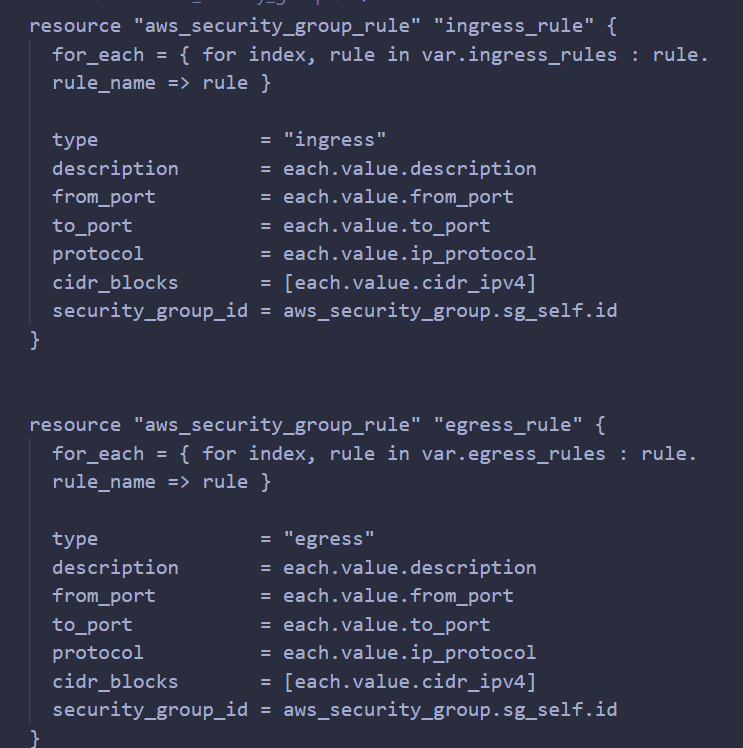
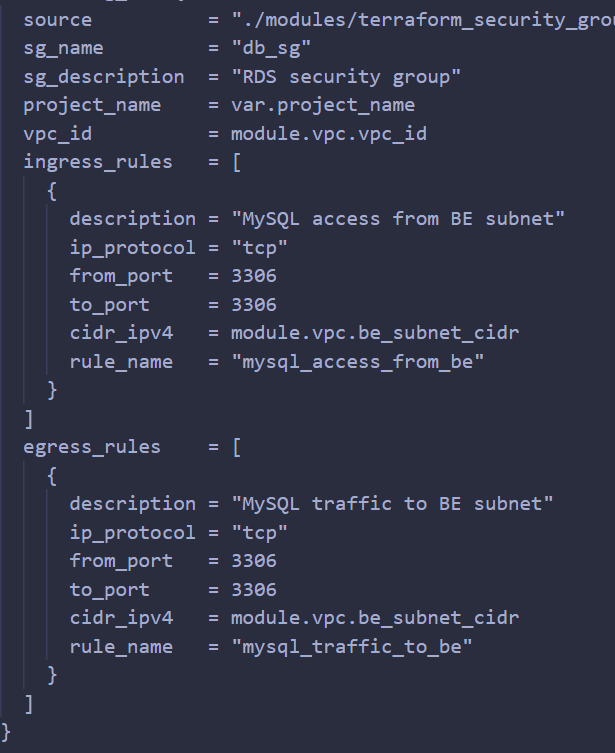
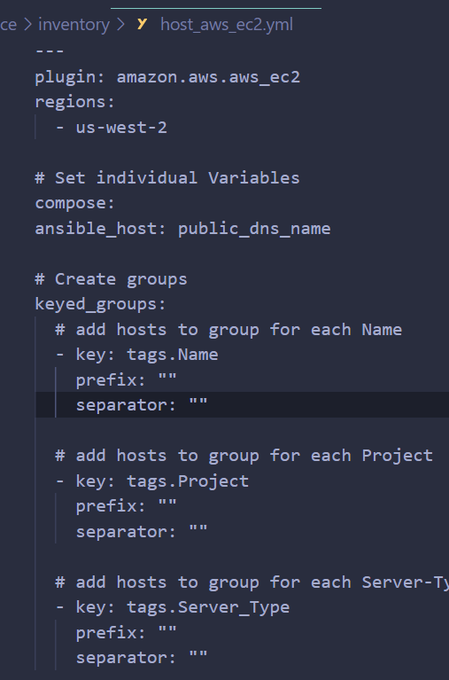
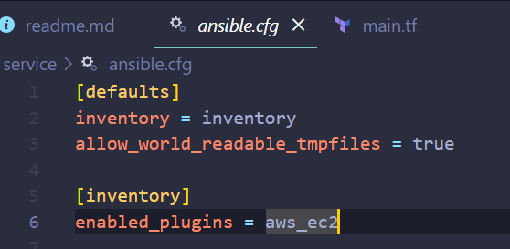
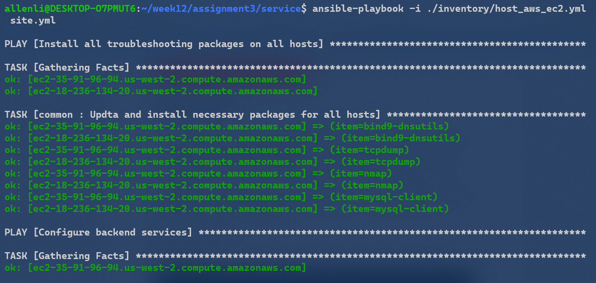
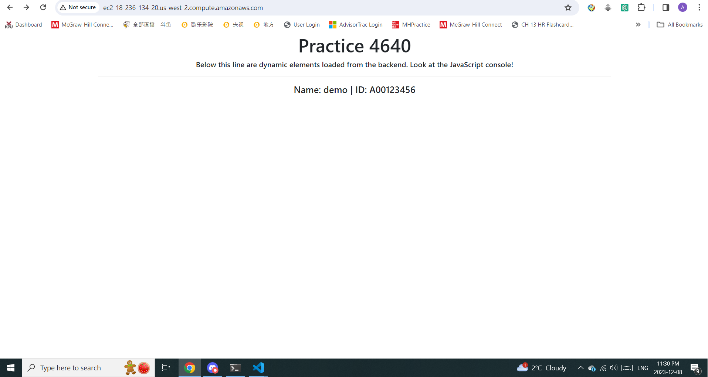
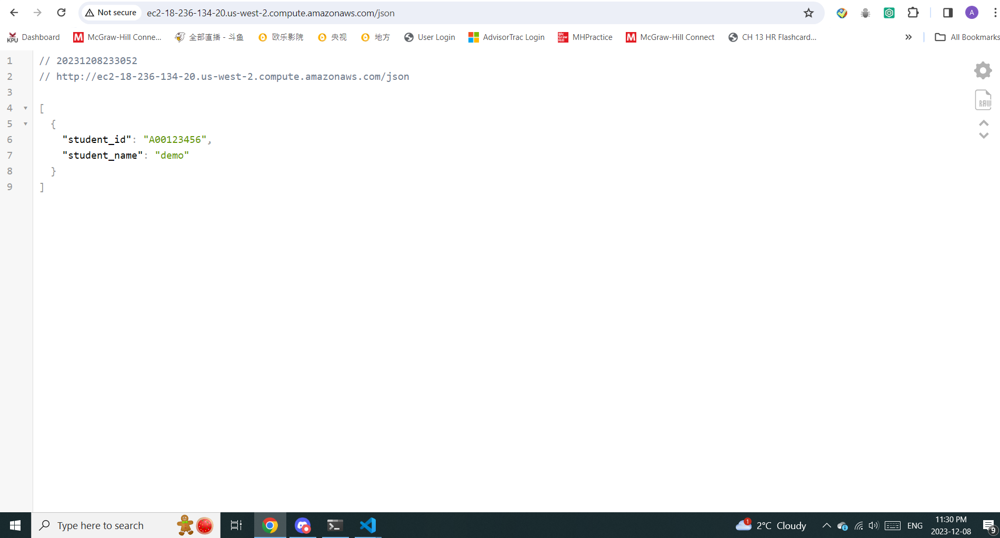

# Assignment 3

## Overview

In this assignment, we will use **Terraform** for provisioning our infrastructure and **Ansible** for configuring each instance to handle different services.

**_*backend_setup*_**: this `be_config.tf` will create a s3 bucket, a table name and it has to be **unique** other wise it won't create for you and alos create a backend_config.tf in **infra** folder like the following:

```sh
terraform {
    backend "s3" {
        bucket         = "allenli-mod-demo-sol-tf-state-2023-11"
        key            = "terraform.tfstate"
        dynamodb_table = "allenli-mod-demo-sol-tf-state-lock-2023-11"
        region         =  "us-west-2"
        encrypt        = true
    }
}
```

command:

```sh
cd backend_setup
terraform init
terraform apply
```

**_infra_**: this folder include 4 moudles

-ec2
-RDS
-security group
-vpc

command:

```sh
cd infra
terraform init #when running this we will intial the backend using the file created by backend_setup
terrform apply # the state_file will save in the s3 bucket now
```

we will use those modules to create **vpc**(subnet, igw, route table..).
two **ec2 instances**: web and backend.
3 **sg groups** web backend and db.



the ingress and egress rule should include **from_port** and **to_port** otherwise it will cause a issue by **"-1"** when we setting a rule from all protocol like to all traffic

**\*RDS DB insatnce**

**\*Important notes**
when we call it we can use the output of each moudle as ref



**service** folder:
command to intial roles for each host and service:

```sh
ansible-galaxy init roles/backend
ansible-galaxy init roles/web
ansible-galaxy init roles/common

```

**what each rolse do we can set in roles/tasks/main.tf**
**templates**: save the template file we use for configure the service
**handler**: saving handlers if needed
**vars**: saving vars if neeed

**site.yml**: this file will tell each role to do thier job
but in order to make that work we need a dynamic inventory folder include:


**when we create ec2 instance in infra we have to include a tag like service_type and it has to match with this file and the \***site.yml**\* file**

and also **ansible.cfg**:

enable aws ec2 plugin

**playbook run command**

```sh
cd service
ansible-playbook -i ./inventory/host_aws_ec2.yml site.yml
# you can change the yml file name if you want i guess
```



**trobleshooting**:

from **backend** instance:

```sh
Nmap -Pn -p 3306 public dns or ip(db instance host on RDS)
```

from **web**:

```sh
Nmap -Pn -p 5000 public dns or ip(backend instance)
```

all works :




